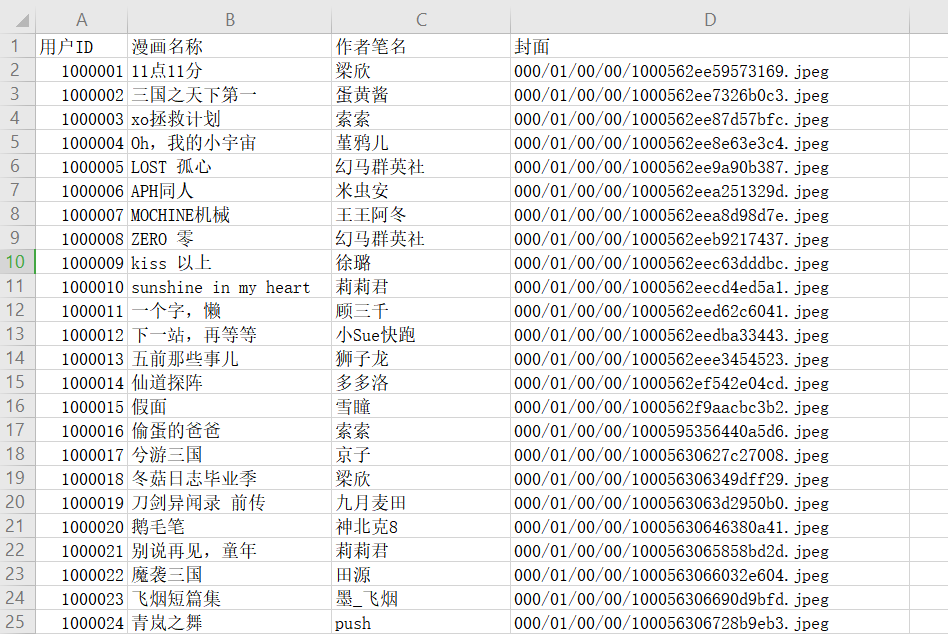

1、说明

PHP 在大数据导出。尤其是上五十万以后，就会显得尤为吃内存，使用常规的导出方法，可能会导致内存溢出，直接整个服务都挂掉。

其实 PHP 从 5.5 开始，就已经有了迭代器 yield，使用 yield，可以大量的节省内存，不用再担心导出百万千万条数据，内存溢出了。

2、配置 

配置MySQL连接参数，在 src/MySQLConfig.php 下

默认使用 default 下标下的配置参数连接，可以在调用时传递指定的连接


3、使用

```php
$csv = new ExportCsv();

$sql = 'select admin_id,user_name,age from admin';

$head = ['用户ID', '用户名', '年龄'];

$csv->exportCsv($sql, $head, 'test_1', '后台用户表');
```

效果示例：



注意：

在导出数据到表格时，第一个字段名尽量不要设置为 'ID' 这两个字母，因为这将会使 wps 报一个 ’wps表格已经监测到...是SYLK文件，但是不能将其加载‘的错误，不妨试一试。